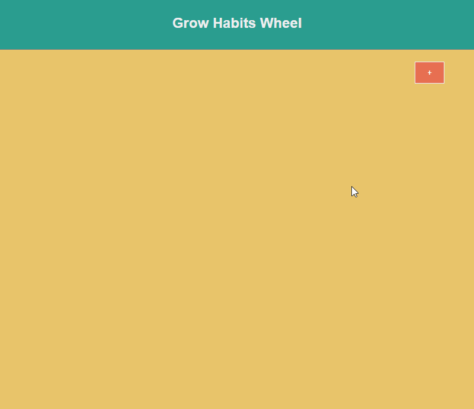

# Grow Habits Wheel
Aplikacja do pielęgnowania dobrych nawyków o których decyduje los na kole fortuny.

## Wymagania
Node.js oraz npm można pobrać z [nodejs.org](https://nodejs.org) 
Uruchomiony serwer (back-end) z [github.com](https://github.com/mateuszjanczak/grow-habits-service)

## Demo
https://grow-habits.herokuapp.com/ (poczekaj, aż heroku wstanie)

## Podgląd

## Skrypty

W folderze z projektem możesz użyć:

### `npm start`

Uruchamianie aplikacji w wersji developerskiej. 

### `npm run build`

Budowanie aplikacji w wersji produkcyjnej. 
